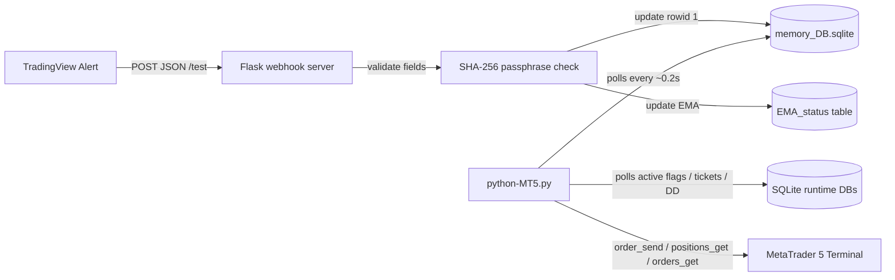

# Pinescript-v6-strategy-with-Json-Webhook-output-example
This PineScript V6 program places dollar cost averaging trades for 2 different strategies and uses arrays of arrays to store data. The strategies compute a signal with TP and SL with a passphrase for the receiving server to accept for security, then send the Json format Webhook with alert feature for the strategy.

EXAMPLE code only as this strategy was probably overfit when I made it as a beginner, so only learn from the code, please!

# LIVE ALERTS PYTH MT5 — TradingView Webhook Strategy

A TradingView Pine Script strategy designed to generate live JSON alerts for an external Python / MT5 execution bridge.

The script is written in Pine Script v6 and runs as a TradingView `strategy()`. It calculates multi-timeframe trend, volatility, imbalance, Bollinger Band Width, and DCA trade states. TradingView is then used to send the current trade state to a webhook as JSON.

> Important: Pine Script cannot directly place trades in MetaTrader 5.  
> This script creates TradingView strategy orders for backtesting/visual tracking and sends webhook alerts. A separate webhook receiver, Python bridge, or MT5 EA must receive the alert JSON and place the real MT5 trades.

---

## Strategy Summary

This strategy is a hybrid mean-reversion / DCA system that uses:

- Dynamic higher-timeframe EMA trend filtering
- Bollinger Band Width volatility regimes
- Normal imbalance entries
- BBW low-volatility imbalance entries
- DCA safety orders
- Take-profit and stop-loss levels
- JSON webhook alerts for external execution
- Separate state fields for normal, BBW, and placeholder OI trade groups

The TradingView strategy name is:

```pine
strategy('LIVE ALERTS PYTH MT5', overlay = true)
```

The strategy is designed to watch price action on TradingView, decide whether the system should be long, short, or flat, and then publish those states through a webhook message.

---

## High-Level Flow

```text
TradingView chart
      |
      v
Pine Script strategy calculates:
- Trend
- Volatility regime
- Entry conditions
- DCA state
- TP / SL levels
      |
      v
Pine Script builds JSON alert payload
      |
      v
TradingView alert sends JSON to webhook URL
      |
      v
Python / MT5 bridge validates passphrase
      |
      v
Bridge opens, updates, or closes MT5 trades
```

---

## Main Strategy Components

## 1. Dynamic Volatility Regime

The script calculates a higher-timeframe Bollinger Band Width value.

The default BBW timeframe is:

```pine
bbw_timeframe = "240"
```

That means the strategy uses a 4-hour volatility regime while it can run on a lower chart timeframe.

The script calculates Bollinger Band Width and then sorts the market into different active levels:

```text
Level 1: very low BBW
Level 2: low BBW
Level 3: moderate BBW
Level 4: rising BBW
Level 5+: higher volatility
```

Each volatility level can change the active settings, including:

- Minimum price imbalance required
- Entry limit offset
- Stop-loss percentage
- BBW entry offset
- Dynamic EMA parameters
- Whether a trade level is enabled

This allows the same strategy to behave differently depending on the volatility environment.

---

## 2. Higher-Timeframe Dynamic EMA

The strategy calculates a dynamic EMA and requests it from another timeframe:

```pine
ema_Period = "15"
```

The EMA trend is classified as:

```text
ht_ema_trend = 1   bullish / rising EMA
ht_ema_trend = -1  bearish / falling EMA
ht_ema_trend = 0   neutral / unchanged
```

The EMA trend is used as a major trade filter.

Normal long DCA trades require bullish EMA trend.

Normal short DCA trades require bearish EMA trend.

If the EMA trend flips against an open normal DCA position, the script closes that position in the TradingView strategy logic.

---

## 3. Normal Imbalance Strategy

The normal imbalance part of the strategy looks for price extending away from recent highs or lows, then prepares a DCA entry.

### Normal Long Setup

A normal long setup is prepared when price breaks below recent lows while the higher-timeframe EMA trend remains bullish.

The logic is roughly:

```text
1. Price breaks below recent low range.
2. Move is large enough compared with the configured minimum imbalance.
3. Normal longs are enabled.
4. Higher-timeframe EMA trend is bullish.
5. Consolidation filter is below the max line.
6. No existing normal small trade is active.
7. A long DCA trigger is stored.
```

When this setup is active, the script stores:

```text
limitEntry_short
L_SLline
limitClose1
normOrder_active
```

The actual normal long DCA position is opened later if price reaches the DCA trigger level.

### Normal Short Setup

A normal short setup is prepared when price breaks above recent highs while the higher-timeframe EMA trend remains bearish.

The logic is roughly:

```text
1. Price breaks above recent high range.
2. Move is large enough compared with the configured minimum imbalance.
3. Normal shorts are enabled.
4. Higher-timeframe EMA trend is bearish.
5. Consolidation filter is below the max line.
6. No existing normal small trade is active.
7. A short DCA trigger is stored.
```

When this setup is active, the script stores:

```text
limitEntry_long
S_SLline
limitClose1
normOrder_active
```

---

## 4. BBW Imbalance Strategy

The BBW strategy is a low-volatility imbalance strategy.

It becomes active when the current Bollinger Band Width is below the selected threshold:

```pine
BBW_active = 1
```

The BBW logic is designed to trade low-volatility imbalance conditions and uses its own entry arrays, stop lines, close lines, and DCA system.

BBW trade direction is controlled by:

```pine
BBW_SHORT_ALLOWED
BBW_LONG_ALLOWED
```

The BBW strategy also uses session filters. The script references Friday, Saturday, and Sunday time windows and only allows certain BBW logic when those time filters are active.

### BBW Long Setup

A BBW long setup is prepared when:

```text
1. BBW is active.
2. BBW longs are allowed.
3. The session filter allows the setup.
4. Price breaks below the previous low.
5. EMA/color condition confirms the setup.
6. No BBW small trade is currently active.
7. A BBW long DCA trigger is stored.
```

### BBW Short Setup

A BBW short setup is prepared when:

```text
1. BBW is active.
2. BBW shorts are allowed.
3. The session filter allows the setup.
4. Price breaks above the previous high.
5. EMA/color condition confirms the setup.
6. No BBW small trade is currently active.
7. A BBW short DCA trigger is stored.
```

---

## 5. DCA Trade Engine

The active trade placement in TradingView is done with `strategy.entry()` and `strategy.close()`.

The script has four main DCA engines:

| Engine | Direction | TradingView Entry ID | Purpose |
|---|---:|---|---|
| Normal Long DCA | Long | `LSODCA` | Normal imbalance long |
| Normal Short DCA | Short | `SSODCA` | Normal imbalance short |
| BBW Long DCA | Long | `LSOBBW` | BBW imbalance long |
| BBW Short DCA | Short | `SSOBBW` | BBW imbalance short |

The code also includes an OI alert slot using `LSOOI` / `SSOOI`, but the provided script does not actively create those entries. The OI fields are included in the webhook payload as a placeholder or extension point.

---

# How Trades Are Placed

## TradingView Backtest / Strategy Trades

Inside TradingView, trades are placed by Pine Script using `strategy.entry()`.

Example normal long DCA entry:

```pine
strategy.entry("LSODCA", strategy.long, qty = (strategy.equity * base_order / 100) / close)
```

Example normal short DCA entry:

```pine
strategy.entry("SSODCA", strategy.short, qty = (strategy.equity * base_S_order / 100) / close)
```

Example BBW long DCA entry:

```pine
strategy.entry("LSOBBW", strategy.long, qty = (strategy.equity * base_order_L_BBW / 100) / close)
```

Example BBW short DCA entry:

```pine
strategy.entry("SSOBBW", strategy.short, qty = (strategy.equity * base_S_order_BBW / 100) / close)
```

These entries are TradingView strategy orders. They are used for backtesting, plotting, and generating state.

---

## DCA Safety Orders

After the first DCA position opens, the script can add more entries using safety orders.

For long DCA trades, the script averages down when price moves below the calculated threshold.

For short DCA trades, the script averages up when price moves above the calculated threshold.

Safety order settings include:

```pine
price_deviation
safe_order
safe_order_volume_scale
safe_order_step_scale
max_safe_order
```

Normal DCA defaults include:

```text
Normal base order: 1.4% of equity
Normal safe order: base_order * 2
Normal max safety orders: 4
```

BBW DCA defaults include:

```text
BBW base order: 30% of equity
BBW safe order: base_order_L_BBW
BBW max safety orders: 2
```

The position size formula is based on strategy equity and current close price:

```text
quantity = (strategy.equity * order_percent / 100) / close
```

---

## Take Profit and Stop Loss

The strategy uses stored close levels and stop lines.

Normal long:

```text
TP: limitClose1[2]
SL: L_SLline[0]
```

Normal short:

```text
TP: limitClose1[0]
SL: S_SLline[0]
```

BBW long:

```text
TP: BBW_LimitClose[2], adjusted by current BBW safety order count
SL: BBW_L_SLline[0]
```

BBW short:

```text
TP: BBW_LimitClose[0], adjusted by current BBW safety order count
SL: BBW_S_SLline[0]
```

The script closes TradingView strategy positions with `strategy.close()` when TP, SL, session, or trend-flip conditions occur.

---

## External MT5 Trade Placement

For live MetaTrader 5 execution, the Pine Script does not place the trades directly.

Instead:

1. Pine Script calculates the current desired trade state.
2. Pine Script sends that state as a JSON alert.
3. TradingView posts the alert to a webhook URL.
4. A Python server, Flask/FastAPI app, or MT5 bridge receives the JSON.
5. The receiver validates the `passphrase`.
6. The receiver reads the side, TP, SL, and EMA fields.
7. The receiver opens, updates, or closes MT5 trades.

A typical receiver should compare the latest alert state with existing MT5 positions.

For example:

```text
side1 = 1   -> normal DCA should be long
side1 = -1  -> normal DCA should be short
side1 = 0   -> no normal DCA trade should be open

side2 = 1   -> BBW DCA should be long
side2 = -1  -> BBW DCA should be short
side2 = 0   -> no BBW DCA trade should be open
```

---

# How the Webhook Works

At the end of the script, the Pine code builds a JSON string.

The payload includes:

```json
{
  "passphrase": "example",
  "side1": "0",
  "side2": "0",
  "side3": "0",
  "TP1": "0",
  "TP2": "0",
  "TP3": "0",
  "SL1": "0",
  "SL2": "0",
  "SL3": "0",
  "EMA": "0"
}
```

The alert is sent with:

```pine
alert(alertstring, alert.freq_all)
```

This means TradingView can send the alert whenever the script executes and the alert call fires.

---

## Webhook Field Meanings

| Field | Meaning |
|---|---|
| `passphrase` | Shared secret used by the webhook receiver to reject unauthorized alerts. |
| `side1` | Normal DCA direction. `1` = long, `-1` = short, `0` = flat. |
| `side2` | BBW DCA direction. `1` = long, `-1` = short, `0` = flat. |
| `side3` | OI strategy slot. Included as a placeholder/extension field. |
| `TP1` | Take-profit level for normal DCA. |
| `TP2` | Take-profit level for BBW DCA. |
| `TP3` | Take-profit level for OI slot. |
| `SL1` | Stop-loss level for normal DCA. |
| `SL2` | Stop-loss level for BBW DCA. |
| `SL3` | Stop-loss level for OI slot. |
| `EMA` | Higher-timeframe EMA trend. `1` = bullish, `-1` = bearish. |

---

## Webhook Example: Normal Long Active

```json
{
  "passphrase": "example",
  "side1": "1",
  "side2": "0",
  "side3": "0",
  "TP1": "68450.25",
  "TP2": "0",
  "TP3": "0",
  "SL1": "66100.00",
  "SL2": "0",
  "SL3": "0",
  "EMA": "1"
}
```

Meaning:

```text
Normal DCA system wants to be long.
Normal TP is 68450.25.
Normal SL is 66100.00.
BBW and OI systems are flat.
EMA trend is bullish.
```

---

## Webhook Example: BBW Short Active

```json
{
  "passphrase": "example",
  "side1": "0",
  "side2": "-1",
  "side3": "0",
  "TP1": "0",
  "TP2": "67250.00",
  "TP3": "0",
  "SL1": "0",
  "SL2": "70100.00",
  "SL3": "0",
  "EMA": "-1"
}
```

Meaning:

```text
BBW DCA system wants to be short.
BBW TP is 67250.00.
BBW SL is 70100.00.
Normal and OI systems are flat.
EMA trend is bearish.
```

---

# Suggested Webhook Receiver Logic

A Python / MT5 receiver can use logic like this:

```python
payload = request.json

if payload["passphrase"] != EXPECTED_PASSPHRASE:
    reject_alert()

normal_side = int(float(payload["side1"]))
bbw_side = int(float(payload["side2"]))

normal_tp = float(payload["TP1"])
normal_sl = float(payload["SL1"])

bbw_tp = float(payload["TP2"])
bbw_sl = float(payload["SL2"])

if normal_side == 1:
    open_or_hold_long(strategy="normal", tp=normal_tp, sl=normal_sl)
elif normal_side == -1:
    open_or_hold_short(strategy="normal", tp=normal_tp, sl=normal_sl)
else:
    close_or_hold_flat(strategy="normal")

if bbw_side == 1:
    open_or_hold_long(strategy="bbw", tp=bbw_tp, sl=bbw_sl)
elif bbw_side == -1:
    open_or_hold_short(strategy="bbw", tp=bbw_tp, sl=bbw_sl)
else:
    close_or_hold_flat(strategy="bbw")
```

The receiver should avoid opening duplicate positions by checking existing MT5 trades before sending new orders.

---

# TradingView Alert Setup

To use the webhook output:

1. Add the strategy to a TradingView chart.
2. Click **Alert**.
3. Select the strategy as the alert condition.
4. Use an alert condition that captures `alert()` function calls.
5. Enable **Webhook URL**.
6. Paste your webhook endpoint URL.
7. Use the script-generated alert message.
8. Make sure your receiver checks the `passphrase`.

The alert payload is generated inside the script, so the external receiver should parse the JSON body sent by TradingView.

---

# Important Implementation Notes

## The Pine Script Emits State, Not Broker Orders

The script sends the full current state on each alert.

Your MT5 bridge should treat the alert as an instruction/state update, not blindly open a new trade every time.

For example, if `side1` remains `1` across many alerts, the receiver should not open a new normal long position on every alert. It should detect that the normal long is already open and hold/update it.

---

## Use Separate Magic Numbers or Comments

For MT5 execution, use different identifiers for each strategy bucket:

```text
normal DCA  -> side1
BBW DCA     -> side2
OI slot     -> side3
```

Recommended MT5 comments:

```text
TV_NORMAL_DCA
TV_BBW_DCA
TV_OI_SLOT
```

This helps the execution bridge update and close the correct trades.

---

## Recommended Receiver Safety Checks

A production webhook receiver should check:

- Passphrase validity
- Symbol allowlist
- Payload JSON validity
- Numeric conversion safety
- Maximum lot size
- Minimum lot size
- Broker trading hours
- Spread limit
- Duplicate-position protection
- Maximum open trades
- Maximum daily loss
- Maximum account drawdown
- TP/SL sanity checks
- Alert timestamp freshness

---

# Strategy Settings Overview

## Main Order Inputs

| Input | Meaning |
|---|---|
| `base_order` | Normal DCA base order percentage of equity. |
| `base_order_L_BBW` | BBW DCA base order percentage of equity. |
| `normalSHORTS_allowed` | Enables/disables normal short setups. |
| `normalLONGS_allowed` | Enables/disables normal long setups. |
| `BBW_SHORT_ALLOWED` | Enables/disables BBW short setups. |
| `BBW_LONG_ALLOWED` | Enables/disables BBW long setups. |
| `MED_trades_allowed` | Medium trade toggle; much of the medium logic appears inactive/commented. |

---

## Volatility / BBW Inputs

| Input | Meaning |
|---|---|
| `bbw_timeframe` | Higher timeframe used for BBW regime. Default is 4h. |
| `length_bbw_ema` | BBW smoothing input. |
| `length_bbw` | EMA length used to smooth BBW. |
| `bbw_input_change` | Threshold used to activate BBW logic. |
| `BBW_stop_loss` | Stop-loss percent used by BBW setups. |
| `BBW_entryLimit_offset` | Entry offset for BBW DCA triggers. |

---

## Normal DCA Inputs

| Input | Meaning |
|---|---|
| `price_deviation` | Distance before opening long safety orders. |
| `safe_order` | Normal long safety order size. |
| `safe_order_volume_scale` | Multiplier for normal long safety order size. |
| `safe_order_step_scale` | Multiplier for normal long safety order spacing. |
| `max_safe_order` | Maximum normal long safety orders. |
| `price_S_deviation` | Distance before opening short safety orders. |
| `safe_S_order` | Normal short safety order size. |
| `safe_S_order_volume_scale` | Multiplier for normal short safety order size. |
| `safe_S_order_step_scale` | Multiplier for normal short safety order spacing. |
| `max_S_safe_order` | Maximum normal short safety orders. |

---

## BBW DCA Inputs

| Input | Meaning |
|---|---|
| `price_deviation_L_BBW` | Distance before opening BBW long safety orders. |
| `safe_order_L_BBW` | BBW long safety order size. |
| `safe_order_volume_scale_L_BBW` | Multiplier for BBW long safety order size. |
| `safe_order_step_scale_L_BBW` | Multiplier for BBW long safety order spacing. |
| `max_safe_order_L_BBW` | Maximum BBW long safety orders. |
| `price_S_deviation_BBW` | Distance before opening BBW short safety orders. |
| `safe_S_order_BBW` | BBW short safety order size. |
| `safe_S_order_volume_scale_BBW` | Multiplier for BBW short safety order size. |
| `safe_S_order_step_scale_BBW` | Multiplier for BBW short safety order spacing. |
| `max_S_safe_order_BBW` | Maximum BBW short safety orders. |

---

# Risk Warning

This strategy uses DCA and safety orders. DCA can increase exposure as price moves against the position.

Before live use:

- Backtest the exact symbol and timeframe.
- Forward-test with paper trading or demo execution.
- Confirm TradingView alerts match MT5 execution.
- Use hard account-level risk limits.
- Confirm the webhook receiver does not duplicate trades.
- Confirm TP and SL values are mapped correctly.
- Start with very small size.

---

# Repository Structure

Suggested GitHub layout:

```text
tradingview-live-alerts-pyth-mt5/
│
├── README.md
├── pine/
│   └── live_alerts_pyth_mt5.pine
│
├── webhook/
│   └── receiver_example.py
│
├── mt5/
│   └── mt5_execution_bridge.py
│
└── docs/
    └── webhook-payload.md
```

# TradingView Webhook to MetaTrader 5 Bot

This project receives TradingView alert webhooks, stores the latest signal values in SQLite, and runs a MetaTrader 5 (MT5) execution process that polls those values and places/manages BTCUSD trades.

> **Risk warning:** This is live-trading automation. Run it on a demo account first, review the logic, and do not use real funds until you have tested every path, error case, and shutdown scenario.

## What the system does

The code is split into two main parts:

1. **Webhook server** (`tradingview_MT5_webhook.py` + `wsgi.py`)
   - Starts a Flask app.
   - Accepts POST requests at `/test`.
   - Validates a TradingView JSON payload.
   - Hash-checks the incoming passphrase against `config.PASSPHRASE`.
   - Writes the latest `side`, `TP`, `SL`, and `EMA` values into `memory_DB.sqlite`.

2. **MT5 execution engine** (`python-MT5.py`)
   - Connects to a MetaTrader 5 terminal/account.
   - Polls SQLite for the latest webhook values.
   - Tracks live BTCUSD price, spread, drawdown, risk, active tickets, and trading time windows.
   - Places pending DCA-style limit orders for three strategy groups: normal, BBW, and OI.
   - Updates open positions when TP/SL values change.
   - Removes pending orders and closes positions when reset, time, or TP conditions are met.

## Architecture



## Repository layout

```text
.
├── tradingview_MT5_webhook.py   # Flask webhook receiver and SQLite signal writer
├── wsgi.py                      # Waitress entrypoint for the Flask app
├── python-MT5.py                # MT5 trading engine, order management, risk checks, UI threads
├── config.py                    # Stores PASSPHRASE hash; do not commit real secrets
└── README.md                    # Project documentation
```

The MT5 script also references files that are not included in the uploaded set:

```text
chart_equity_live.py   # Optional chart process launched by python-MT5.py
forest-dark.tcl        # Tkinter theme used by the status window
*.sqlite               # Runtime SQLite databases used for memory, tickets, equity, drawdown
```

## Data flow

1. TradingView sends an alert to the Flask endpoint:

   ```text
   POST http://<server-host>:5000/test
   ```

2. `tradingview_MT5_webhook.py` checks that the request contains these fields:

   ```json
   {
     "passphrase": "yourpassphrase",
     "side1": "1",
     "side2": "0",
     "side3": "-1",
     "TP1": "65000",
     "TP2": "66000",
     "TP3": "64000",
     "SL1": "62000",
     "SL2": "62500",
     "SL3": "61500",
     "EMA": "1"
   }
   ```

3. The server hashes `passphrase` with SHA-256 and compares it to `config.PASSPHRASE`.

4. On success, it updates row `1` in the SQLite tables:

   - `memory_DB.sqlite` → `memory_DB.side1`, `side2`, `side3`, `TP1`, `TP2`, `TP3`, `SL1`, `SL2`, `SL3`
   - `memory_DB.sqlite` → `EMA_status.EMA`

5. `python-MT5.py` continuously reads these values and stores them in global variables:

   ```text
   side1, side2, side3
   dbTP1, dbTP2, dbTP3
   dbSL1, dbSL2, dbSL3
   ema_status
   ```

6. If the trading conditions are met, the MT5 script places pending orders through `mt5.order_send()`.

## Strategy groups

The MT5 runner manages three separate strategy groups.

| Strategy group | Signal fields | Ticket database | Active flag table | Max DCA orders | Notes |
|---|---:|---|---|---:|---|
| Normal | `side1`, `TP1`, `SL1` | `tickets.sqlite` | `norm_active` | 5 long / 5 short | Uses `base_order_norm` and normal thresholds. |
| BBW | `side2`, `TP2`, `SL2` | `tickets_bbw.sqlite` | `bbw_active` | 3 long / 3 short | Uses larger base order sizing in current code. |
| OI | `side3`, `TP3`, `SL3`, `EMA` | `tickets_OI.sqlite` | `oi_active` | 5 long / 5 short | Requires EMA direction to match trade side. |

General order behaviour:

- Long signals place `BUY_LIMIT` pending orders.
- Short signals place `SELL_LIMIT` pending orders.
- Lot sizes are calculated from `account_balance`, base order percentage, and live BTCUSD price.
- Lot sizes are rounded down to two decimals.
- Subsequent DCA orders increase lot size unless `no_first_order` is enabled.
- Active ticket IDs are stored in the relevant SQLite ticket table.

## Trading gates and risk controls

Before placing new orders, the script checks several gates:

- Strategy active flag is not already set.
- Trading time window allows new orders.
- Daily drawdown flag is not active.
- Total calculated risk does not exceed `input_risk_total_global`.
- Current price has moved far enough away from the relevant TP reference.
- For OI orders, `ema_status` must match trade direction.

The script also:

- Calculates open and pending order risk from stop-loss distance, volume, and `account_balance`.
- Reads `equity_daily_drawdown.sqlite` and disables new orders when drawdown exceeds `max_daily_dd_percentage`.
- Records equity snapshots in `equity_data.sqlite` while positions are open.
- Can place a tiny “inactivity” trade if no MT5 deal history is found within `number_of_days_before_account_inactive`.

## Setup

### 1. Install Python dependencies

Recommended Python version: 3.10+.

```bash
python -m venv .venv
# Windows
.venv\Scripts\activate
# macOS/Linux
source .venv/bin/activate

pip install flask waitress MetaTrader5 pandas numpy termcolor tabulate matplotlib
```

`tkinter`, `sqlite3`, `logging`, `threading`, `subprocess`, and `datetime` are from the Python standard library, but your Python installation must include Tk support if you want the status window.

### 2. Configure MT5

`python-MT5.py` currently initializes MT5 directly in the source file. Before using the bot, replace the hard-coded MT5 account settings with your own values or, preferably, move them to environment variables.

Recommended pattern:

```python
import os

MT5_LOGIN = int(os.environ["MT5_LOGIN"])
MT5_SERVER = os.environ["MT5_SERVER"]
MT5_PASSWORD = os.environ["MT5_PASSWORD"]

mt5.initialize(login=MT5_LOGIN, server=MT5_SERVER, password=MT5_PASSWORD)
```

Never commit real MT5 credentials to GitHub.

### 3. Configure the webhook passphrase

The code expects `config.PASSPHRASE` to contain the **SHA-256 hash** of the passphrase TradingView sends, not the plain text passphrase.

Generate the hash:

```bash
python -c "import hashlib; print(hashlib.sha256(b'yourpassphrase').hexdigest())"
```

Then set `config.py`:

```python
PASSPHRASE = "<sha256-hex-digest>"
```

### 4. Bootstrap the SQLite databases

The scripts expect several SQLite databases and single-row tables to exist. Create them before the first run.

```python
# bootstrap_db.py
import sqlite3


def exec_sql(db_name, statements):
    conn = sqlite3.connect(db_name)
    cur = conn.cursor()
    for statement in statements:
        cur.execute(statement)
    conn.commit()
    conn.close()


exec_sql("memory_DB.sqlite", [
    """
    CREATE TABLE IF NOT EXISTS memory_DB (
        side1 REAL DEFAULT 0,
        side2 REAL DEFAULT 0,
        side3 REAL DEFAULT 0,
        TP1 REAL DEFAULT 0,
        TP2 REAL DEFAULT 0,
        TP3 REAL DEFAULT 0,
        SL1 REAL DEFAULT 0,
        SL2 REAL DEFAULT 0,
        SL3 REAL DEFAULT 0
    )
    """,
    "INSERT OR IGNORE INTO memory_DB (rowid, side1, side2, side3, TP1, TP2, TP3, SL1, SL2, SL3) VALUES (1, 0, 0, 0, 0, 0, 0, 0, 0, 0)",
    "CREATE TABLE IF NOT EXISTS EMA_status (EMA REAL DEFAULT 0)",
    "INSERT OR IGNORE INTO EMA_status (rowid, EMA) VALUES (1, 0)",
])

exec_sql("memory_live_entries_DB.sqlite", [
    "CREATE TABLE IF NOT EXISTS norm_active (norm_active REAL DEFAULT 0)",
    "INSERT OR IGNORE INTO norm_active (rowid, norm_active) VALUES (1, 0)",
    "CREATE TABLE IF NOT EXISTS bbw_active (bbw_active REAL DEFAULT 0)",
    "INSERT OR IGNORE INTO bbw_active (rowid, bbw_active) VALUES (1, 0)",
    "CREATE TABLE IF NOT EXISTS oi_active (oi_active REAL DEFAULT 0)",
    "INSERT OR IGNORE INTO oi_active (rowid, oi_active) VALUES (1, 0)",
])

exec_sql("tickets.sqlite", [
    "CREATE TABLE IF NOT EXISTS order_tickets_norm_L (order_tickets_norm_L INTEGER)",
    "CREATE TABLE IF NOT EXISTS order_tickets_norm_S (order_tickets_norm_S INTEGER)",
])

exec_sql("tickets_bbw.sqlite", [
    "CREATE TABLE IF NOT EXISTS order_tickets_bbw_L (order_tickets_bbw_L INTEGER)",
    "CREATE TABLE IF NOT EXISTS order_tickets_bbw_S (order_tickets_bbw_S INTEGER)",
])

exec_sql("tickets_OI.sqlite", [
    "CREATE TABLE IF NOT EXISTS order_tickets_oi_L (order_tickets_oi_L INTEGER)",
    "CREATE TABLE IF NOT EXISTS order_tickets_oi_S (order_tickets_oi_S INTEGER)",
])

exec_sql("equity_daily_drawdown.sqlite", [
    "CREATE TABLE IF NOT EXISTS equitydd (equitydd REAL DEFAULT 0)",
    "INSERT OR IGNORE INTO equitydd (rowid, equitydd) VALUES (1, 0)",
])

print("SQLite databases initialized.")
```

Run it once:

```bash
python bootstrap_db.py
```

## Running the project

### Run only the webhook server

```bash
python wsgi.py
```

By default, `wsgi.py` serves the Flask app with Waitress at:

```text
127.0.0.1:5000
```

This is local-only. TradingView cannot reach `127.0.0.1` unless you put the app behind a public HTTPS reverse proxy, VPS, tunnel, or other deployment layer.

### Run the full MT5 bot

```bash
python python-MT5.py
```

This starts multiple threads, including:

- the Waitress webhook process through `wsgi.py`
- the optional chart process through `chart_equity_live.py`
- the Tkinter status window
- SQLite polling threads
- normal, BBW, and OI order threads
- SL/TP update threads
- close/reset threads
- risk, drawdown, equity, and account-inactivity monitors

Do not run a second copy of the bot against the same MT5 account and SQLite databases unless you have made the database and order-management logic safe for multi-process use.

## Testing the webhook

With `wsgi.py` running, send a test alert locally:

```bash
curl -X POST http://127.0.0.1:5000/test \
  -H "Content-Type: application/json" \
  -d '{
    "passphrase": "yourpassphrase",
    "side1": "1",
    "side2": "0",
    "side3": "0",
    "TP1": "65000",
    "TP2": "0",
    "TP3": "0",
    "SL1": "62000",
    "SL2": "0",
    "SL3": "0",
    "EMA": "1"
  }'
```

Expected response from the current code:

```json
{"code":"error","message":"K"}
```

The response uses `code: "error"` even on success, because that is how the current route is written. Consider changing this to something clearer, such as `{"code":"ok","message":"updated"}`.

## TradingView alert template

Use a JSON alert message that matches the fields required by `/test`:

```json
{
  "passphrase": "yourpassphrase",
  "side1": "{{plot_0}}",
  "side2": "{{plot_1}}",
  "side3": "{{plot_2}}",
  "TP1": "{{plot_3}}",
  "TP2": "{{plot_4}}",
  "TP3": "{{plot_5}}",
  "SL1": "{{plot_6}}",
  "SL2": "{{plot_7}}",
  "SL3": "{{plot_8}}",
  "EMA": "{{plot_9}}"
}
```

Adjust the `{{plot_n}}` placeholders to match your Pine Script outputs.

## Important configuration values

Most trading settings are currently hard-coded near the top of `python-MT5.py`.

| Setting | Meaning |
|---|---|
| `symbol` | Trading symbol; currently `BTCUSD`. |
| `account_balance` | Used for position sizing and risk calculations. |
| `base_order_norm` | Normal strategy base order percentage. |
| `base_order_bbw` | BBW strategy base order percentage. |
| `base_order_oi` | OI strategy base order percentage. |
| `max_daily_dd_percentage` | Drawdown threshold that blocks new orders. |
| `input_risk_total_global` | Total risk threshold that blocks new orders. |
| `time_open_threshhold_*` | Price movement thresholds before opening orders. |
| `time_close_threshhold` | Price threshold used when closing before swap/time windows. |
| `max_dca_orders*` | Maximum pending DCA orders per strategy and side. |
| `no_first_order` | Option to skip/differentiate first DCA order behaviour. |

For GitHub/public use, consider moving these values into a `settings.py`, `.env`, or `config.example.py` file.

## Runtime files to ignore in Git

Add a `.gitignore` similar to this:

```gitignore
# secrets
config.py
.env

# Python
__pycache__/
*.pyc
.venv/

# logs
*.log

# SQLite runtime state
*.sqlite
*.sqlite-wal
*.sqlite-shm
*.db

# local UI/theme/runtime extras
forest-dark.tcl
```

Commit a safe example instead:

```python
# config.example.py
PASSPHRASE = "replace-with-sha256-hash"
```

## Production hardening checklist

Before exposing this publicly or trading live, review these items:

- **Move credentials out of source code.** MT5 login, server, password, and webhook passphrase hash should not be committed.
- **Enforce IP allowlisting or stronger authentication.** TradingView IPs are listed in the webhook file, but the active decorator only checks that the method is POST.
- **Use HTTPS.** TradingView webhooks should be sent to a secure HTTPS endpoint.
- **Fix success/error response naming.** The success path currently returns `code: "error"` with HTTP 200.
- **Add database initialization.** The MT5 runner expects several tables to already exist and can crash if they do not.
- **Add structured error handling and shutdown.** Many threads run forever and are joined indefinitely.
- **Avoid duplicate bot instances.** Multiple copies can place duplicate orders or fight over the same SQLite ticket tables.
- **Validate trading inputs more strictly.** Current validation checks numeric type but not ranges, side values, or symbol-specific constraints.
- **Make account balance dynamic.** Risk calculations use a hard-coded `account_balance`, while MT5 account equity can change.
- **Test every close path.** The close/reset functions delete ticket rows in multiple cases; verify this matches your broker and account mode.

## Troubleshooting

### `401` from `/test`

The passphrase hash does not match. Make sure TradingView sends the plain passphrase and `config.PASSPHRASE` stores the SHA-256 hash of that passphrase.

### `400` from `/test`

A required field is missing or one of the numeric fields cannot be converted to a float.

### MT5 initialization fails

Check that:

- MetaTrader 5 terminal is installed and running.
- The account is logged in.
- Login, server, and password are correct.
- The Python package can connect to the terminal on your machine.

### SQLite table errors

Run the bootstrap script shown above. The current code expects `memory_DB`, `EMA_status`, active flag tables, ticket tables, and drawdown tables to exist.

### TradingView cannot reach the server

`wsgi.py` binds to `127.0.0.1`, which is local-only. Deploy behind a public HTTPS endpoint or change the host binding carefully after adding authentication and firewall rules.

## Disclaimer

This software is provided for educational and automation purposes only. It is not financial advice. Automated trading can lose money quickly, especially when orders are placed from webhook signals without manual review.


